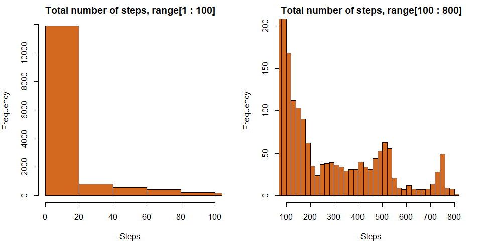
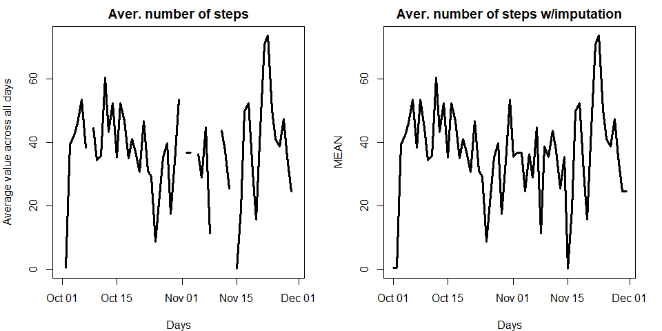
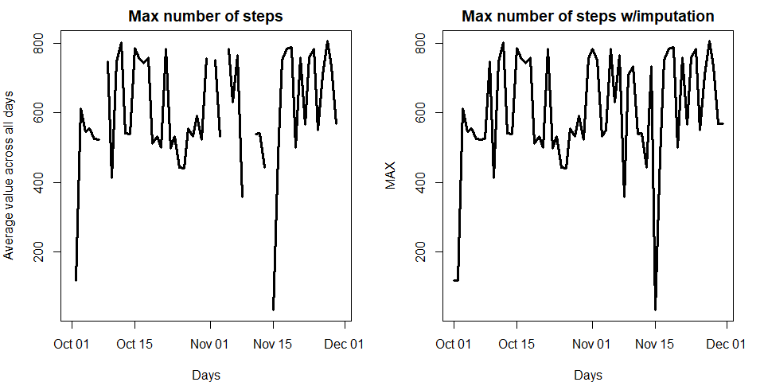
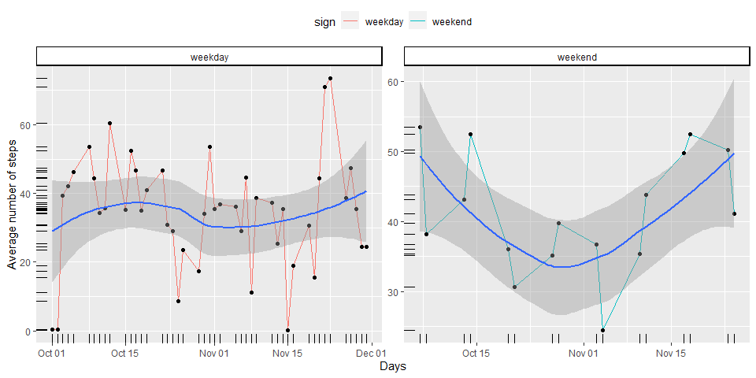

### Setting global options


## Preparing an environment


```r
library(dplyr)
```

```
## 
## Attaching package: 'dplyr'
```

```
## The following objects are masked from 'package:stats':
## 
##     filter, lag
```

```
## The following objects are masked from 'package:base':
## 
##     intersect, setdiff, setequal, union
```

```r
library(mice)
```

```
## 
## Attaching package: 'mice'
```

```
## The following objects are masked from 'package:base':
## 
##     cbind, rbind
```

```r
library(ggplot2)
path <- getwd()
```


## Loading and preprocessing the data


```r
if (!file.exists("Activity.zip")) {
Url <- "https://d396qusza40orc.cloudfront.net/repdata%2Fdata%2Factivity.zip"

download.file(Url, destfile = paste0(path, "/Activity.zip"), method = "curl")

if (!file.exists("Activity.csv")) {unzip(zipfile = paste0(path, "Activity.zip"), exdir = ".")}
}

AC <- read.csv("./activity.csv", header = TRUE, sep = ",", na.strings = "NA", stringsAsFactors = FALSE, colClasses = c("integer", "Date", "integer"))
```


## What is mean total number of steps taken per day?


```r
paste0("Mean of steps per day for all dataset = ", round(mean(AC$steps, na.rm = TRUE), 3))
```

```
## [1] "Mean of steps per day for all dataset = 37.383"
```

```r
paste0("Median of steps per day for all dataset = ", round(median(AC$steps, na.rm = TRUE), 3))
```

```
## [1] "Median of steps per day for all dataset = 0"
```

## Plotting a mean total number of steps


```r
par(mfrow = c(1, 2), mar = c(4, 4, 2, 2))
hist(AC$steps, xlim = c(0, 100), breaks = 50, main = "Total number of steps, range[1 : 100]", xlab = "Steps", col = "chocolate", border = "black")
hist(AC$steps, xlim = c(100, max(AC$steps, na.rm = TRUE)), ylim = c(0, 200), breaks = 50, main = "Total number of steps, range[100 : 800]", xlab = "Steps", col = "chocolate", border = "black")
```

<!-- -->

## What is the average daily activity pattern? ..with and without imputation separately by subsets


```r
TOT_mean <- AC %>% group_by(date) %>% summarise(MEAN = mean(steps, na.rm = TRUE))
inp_data <- mice(TOT_mean, m = 5, method = "pmm", maxit = 40, seed = 500)
```

```
## 
##  iter imp variable
##   1   1  MEAN
##   1   2  MEAN
##   1   3  MEAN
##   1   4  MEAN
##   1   5  MEAN
##   2   1  MEAN
##   2   2  MEAN
##   2   3  MEAN
##   2   4  MEAN
##   2   5  MEAN
##   3   1  MEAN
##   3   2  MEAN
##   3   3  MEAN
##   3   4  MEAN
##   3   5  MEAN
##   4   1  MEAN
##   4   2  MEAN
##   4   3  MEAN
##   4   4  MEAN
##   4   5  MEAN
##   5   1  MEAN
##   5   2  MEAN
##   5   3  MEAN
##   5   4  MEAN
##   5   5  MEAN
##   6   1  MEAN
##   6   2  MEAN
##   6   3  MEAN
##   6   4  MEAN
##   6   5  MEAN
##   7   1  MEAN
##   7   2  MEAN
##   7   3  MEAN
##   7   4  MEAN
##   7   5  MEAN
##   8   1  MEAN
##   8   2  MEAN
##   8   3  MEAN
##   8   4  MEAN
##   8   5  MEAN
##   9   1  MEAN
##   9   2  MEAN
##   9   3  MEAN
##   9   4  MEAN
##   9   5  MEAN
##   10   1  MEAN
##   10   2  MEAN
##   10   3  MEAN
##   10   4  MEAN
##   10   5  MEAN
##   11   1  MEAN
##   11   2  MEAN
##   11   3  MEAN
##   11   4  MEAN
##   11   5  MEAN
##   12   1  MEAN
##   12   2  MEAN
##   12   3  MEAN
##   12   4  MEAN
##   12   5  MEAN
##   13   1  MEAN
##   13   2  MEAN
##   13   3  MEAN
##   13   4  MEAN
##   13   5  MEAN
##   14   1  MEAN
##   14   2  MEAN
##   14   3  MEAN
##   14   4  MEAN
##   14   5  MEAN
##   15   1  MEAN
##   15   2  MEAN
##   15   3  MEAN
##   15   4  MEAN
##   15   5  MEAN
##   16   1  MEAN
##   16   2  MEAN
##   16   3  MEAN
##   16   4  MEAN
##   16   5  MEAN
##   17   1  MEAN
##   17   2  MEAN
##   17   3  MEAN
##   17   4  MEAN
##   17   5  MEAN
##   18   1  MEAN
##   18   2  MEAN
##   18   3  MEAN
##   18   4  MEAN
##   18   5  MEAN
##   19   1  MEAN
##   19   2  MEAN
##   19   3  MEAN
##   19   4  MEAN
##   19   5  MEAN
##   20   1  MEAN
##   20   2  MEAN
##   20   3  MEAN
##   20   4  MEAN
##   20   5  MEAN
##   21   1  MEAN
##   21   2  MEAN
##   21   3  MEAN
##   21   4  MEAN
##   21   5  MEAN
##   22   1  MEAN
##   22   2  MEAN
##   22   3  MEAN
##   22   4  MEAN
##   22   5  MEAN
##   23   1  MEAN
##   23   2  MEAN
##   23   3  MEAN
##   23   4  MEAN
##   23   5  MEAN
##   24   1  MEAN
##   24   2  MEAN
##   24   3  MEAN
##   24   4  MEAN
##   24   5  MEAN
##   25   1  MEAN
##   25   2  MEAN
##   25   3  MEAN
##   25   4  MEAN
##   25   5  MEAN
##   26   1  MEAN
##   26   2  MEAN
##   26   3  MEAN
##   26   4  MEAN
##   26   5  MEAN
##   27   1  MEAN
##   27   2  MEAN
##   27   3  MEAN
##   27   4  MEAN
##   27   5  MEAN
##   28   1  MEAN
##   28   2  MEAN
##   28   3  MEAN
##   28   4  MEAN
##   28   5  MEAN
##   29   1  MEAN
##   29   2  MEAN
##   29   3  MEAN
##   29   4  MEAN
##   29   5  MEAN
##   30   1  MEAN
##   30   2  MEAN
##   30   3  MEAN
##   30   4  MEAN
##   30   5  MEAN
##   31   1  MEAN
##   31   2  MEAN
##   31   3  MEAN
##   31   4  MEAN
##   31   5  MEAN
##   32   1  MEAN
##   32   2  MEAN
##   32   3  MEAN
##   32   4  MEAN
##   32   5  MEAN
##   33   1  MEAN
##   33   2  MEAN
##   33   3  MEAN
##   33   4  MEAN
##   33   5  MEAN
##   34   1  MEAN
##   34   2  MEAN
##   34   3  MEAN
##   34   4  MEAN
##   34   5  MEAN
##   35   1  MEAN
##   35   2  MEAN
##   35   3  MEAN
##   35   4  MEAN
##   35   5  MEAN
##   36   1  MEAN
##   36   2  MEAN
##   36   3  MEAN
##   36   4  MEAN
##   36   5  MEAN
##   37   1  MEAN
##   37   2  MEAN
##   37   3  MEAN
##   37   4  MEAN
##   37   5  MEAN
##   38   1  MEAN
##   38   2  MEAN
##   38   3  MEAN
##   38   4  MEAN
##   38   5  MEAN
##   39   1  MEAN
##   39   2  MEAN
##   39   3  MEAN
##   39   4  MEAN
##   39   5  MEAN
##   40   1  MEAN
##   40   2  MEAN
##   40   3  MEAN
##   40   4  MEAN
##   40   5  MEAN
```

```r
TOT_mean_imp <- complete(inp_data, 5)

TOT_max <- AC %>% group_by(date) %>% summarise(MAX = max(steps, na.rm = TRUE))
TOT_max$MAX <- replace(TOT_max$MAX, as.numeric(which(TOT_max$MAX == "-Inf")), NaN)
inp_data <- mice(TOT_max, m = 5, method = "pmm", maxit = 40, seed = 500)
```

```
## 
##  iter imp variable
##   1   1  MAX
##   1   2  MAX
##   1   3  MAX
##   1   4  MAX
##   1   5  MAX
##   2   1  MAX
##   2   2  MAX
##   2   3  MAX
##   2   4  MAX
##   2   5  MAX
##   3   1  MAX
##   3   2  MAX
##   3   3  MAX
##   3   4  MAX
##   3   5  MAX
##   4   1  MAX
##   4   2  MAX
##   4   3  MAX
##   4   4  MAX
##   4   5  MAX
##   5   1  MAX
##   5   2  MAX
##   5   3  MAX
##   5   4  MAX
##   5   5  MAX
##   6   1  MAX
##   6   2  MAX
##   6   3  MAX
##   6   4  MAX
##   6   5  MAX
##   7   1  MAX
##   7   2  MAX
##   7   3  MAX
##   7   4  MAX
##   7   5  MAX
##   8   1  MAX
##   8   2  MAX
##   8   3  MAX
##   8   4  MAX
##   8   5  MAX
##   9   1  MAX
##   9   2  MAX
##   9   3  MAX
##   9   4  MAX
##   9   5  MAX
##   10   1  MAX
##   10   2  MAX
##   10   3  MAX
##   10   4  MAX
##   10   5  MAX
##   11   1  MAX
##   11   2  MAX
##   11   3  MAX
##   11   4  MAX
##   11   5  MAX
##   12   1  MAX
##   12   2  MAX
##   12   3  MAX
##   12   4  MAX
##   12   5  MAX
##   13   1  MAX
##   13   2  MAX
##   13   3  MAX
##   13   4  MAX
##   13   5  MAX
##   14   1  MAX
##   14   2  MAX
##   14   3  MAX
##   14   4  MAX
##   14   5  MAX
##   15   1  MAX
##   15   2  MAX
##   15   3  MAX
##   15   4  MAX
##   15   5  MAX
##   16   1  MAX
##   16   2  MAX
##   16   3  MAX
##   16   4  MAX
##   16   5  MAX
##   17   1  MAX
##   17   2  MAX
##   17   3  MAX
##   17   4  MAX
##   17   5  MAX
##   18   1  MAX
##   18   2  MAX
##   18   3  MAX
##   18   4  MAX
##   18   5  MAX
##   19   1  MAX
##   19   2  MAX
##   19   3  MAX
##   19   4  MAX
##   19   5  MAX
##   20   1  MAX
##   20   2  MAX
##   20   3  MAX
##   20   4  MAX
##   20   5  MAX
##   21   1  MAX
##   21   2  MAX
##   21   3  MAX
##   21   4  MAX
##   21   5  MAX
##   22   1  MAX
##   22   2  MAX
##   22   3  MAX
##   22   4  MAX
##   22   5  MAX
##   23   1  MAX
##   23   2  MAX
##   23   3  MAX
##   23   4  MAX
##   23   5  MAX
##   24   1  MAX
##   24   2  MAX
##   24   3  MAX
##   24   4  MAX
##   24   5  MAX
##   25   1  MAX
##   25   2  MAX
##   25   3  MAX
##   25   4  MAX
##   25   5  MAX
##   26   1  MAX
##   26   2  MAX
##   26   3  MAX
##   26   4  MAX
##   26   5  MAX
##   27   1  MAX
##   27   2  MAX
##   27   3  MAX
##   27   4  MAX
##   27   5  MAX
##   28   1  MAX
##   28   2  MAX
##   28   3  MAX
##   28   4  MAX
##   28   5  MAX
##   29   1  MAX
##   29   2  MAX
##   29   3  MAX
##   29   4  MAX
##   29   5  MAX
##   30   1  MAX
##   30   2  MAX
##   30   3  MAX
##   30   4  MAX
##   30   5  MAX
##   31   1  MAX
##   31   2  MAX
##   31   3  MAX
##   31   4  MAX
##   31   5  MAX
##   32   1  MAX
##   32   2  MAX
##   32   3  MAX
##   32   4  MAX
##   32   5  MAX
##   33   1  MAX
##   33   2  MAX
##   33   3  MAX
##   33   4  MAX
##   33   5  MAX
##   34   1  MAX
##   34   2  MAX
##   34   3  MAX
##   34   4  MAX
##   34   5  MAX
##   35   1  MAX
##   35   2  MAX
##   35   3  MAX
##   35   4  MAX
##   35   5  MAX
##   36   1  MAX
##   36   2  MAX
##   36   3  MAX
##   36   4  MAX
##   36   5  MAX
##   37   1  MAX
##   37   2  MAX
##   37   3  MAX
##   37   4  MAX
##   37   5  MAX
##   38   1  MAX
##   38   2  MAX
##   38   3  MAX
##   38   4  MAX
##   38   5  MAX
##   39   1  MAX
##   39   2  MAX
##   39   3  MAX
##   39   4  MAX
##   39   5  MAX
##   40   1  MAX
##   40   2  MAX
##   40   3  MAX
##   40   4  MAX
##   40   5  MAX
```

```r
TOT_max_imp <- complete(inp_data, 5)
```


```r
paste0("Mean of of the total daily number of steps = ", round(mean(TOT_mean$MEAN, na.rm = TRUE), 3))
```

```
## [1] "Mean of of the total daily number of steps = 37.383"
```

```r
paste0("Median of of the total daily number of steps = ", round(median(TOT_mean$MEAN, na.rm = TRUE), 3))
```

```
## [1] "Median of of the total daily number of steps = 37.378"
```


## Plotting average daily activity pattern (mean value)


```r
par(mfrow = c(1, 2), mar = c(4, 4, 2, 2))
plot(TOT_mean, type = "l", lty = 1, lwd = 3, main = "Aver. number of steps", xlab = "Days", ylab = "Average value across all days")
plot(TOT_mean_imp, type = "l", lty = 1, lwd = 3, main = "Aver. number of steps w/imputation", xlab = "Days")
```

<!-- -->

## Plotting average daily activity pattern (max value)


```r
par(mfrow = c(1, 2), mar = c(4, 4, 2, 2))
plot(TOT_max, type = "l", lty = 1, lwd = 3, main = "Max number of steps", xlab = "Days", ylab = "Average value across all days")
plot(TOT_max_imp, type = "l", lty = 1, lwd = 3, main = "Max number of steps w/imputation", xlab = "Days")
```

<!-- -->

## Imputing missing values


```r
paste0("Total number of missing values in the dataset = ", length(as.numeric(which(is.na(AC)))), ", this is ", round(mean(is.na(AC))*100, 3), " % from common volume")
```

```
## [1] "Total number of missing values in the dataset = 2304, this is 4.372 % from common volume"
```

```r
a1 <- mean(TOT_mean$MEAN, na.rm = TRUE)
a2 <- mean(TOT_mean_imp$MEAN)
if (a1 > a2) {paste0("Imputing missing data is decrased a mean of the total daily number of steps on ", round((abs(a1 - a2)/max(a1, a2) * 100), 3), " %")} else {paste0("Imputing missing data is incrased a mean of the total daily number of steps on ", round((abs(a1 - a2)/max(a1, a2) * 100), 3), " %")}
```

```
## [1] "Imputing missing data is decrased a mean of the total daily number of steps on 2.25 %"
```

```r
a3 <- mean(TOT_max$MAX, na.rm = TRUE)
a4 <- mean(TOT_max_imp$MAX)
if (a1 > a2) {paste0("Imputing missing data is decrased a max of the total daily number of steps on ", round((abs(a3 - a4)/max(a3, a4) * 100), 3), " %")} else {paste0("Imputing missing data is incrased a max of the total daily number of steps on ", round((abs(a3 - a4)/max(a3, a4) * 100), 3), " %")}
```

```
## [1] "Imputing missing data is decrased a max of the total daily number of steps on 0.232 %"
```

## Are there differences in activity patterns between weekdays and weekends?


```r
for (i in 1:nrow(TOT_mean_imp)) {
        ifelse(weekdays(TOT_mean_imp$date[i]) == "Saturday" | weekdays(TOT_mean_imp$date[i]) == "Sunday", TOT_mean_imp$sign[i] <- "weekend", TOT_mean_imp$sign[i] <- "weekday")
}

ggplot(data = TOT_mean_imp, aes(x = date, y = MEAN), mar = c(4, 4, 2, 2)) + geom_line(stat = "identity", aes(x = date, y = MEAN, color = sign)) + geom_point() + facet_wrap(.~sign, ncol = 2, scales = "free") + xlab("Days") + ylab("Average number of steps") + theme(strip.background = element_rect(colour = "black", fill =  "white", size = 1, linetype = "solid"), legend.position = "top") + geom_smooth(span = 1) + geom_rug()
```

```
## `geom_smooth()` using method = 'loess' and formula 'y ~ x'
```

<!-- -->

